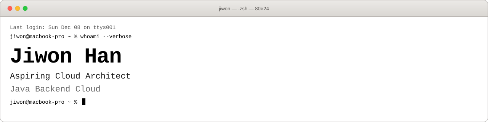

<!-- 헤더 -->

  <picture>
    <source media="(prefers-color-scheme: dark)" srcset="./assets/banner-windows.svg?v=2" />
    
  </picture>

 

## 🛠️ Tech Stacks

  

 

## ✉️ Contact me

  

 
 

<!-- profile views -->

  

